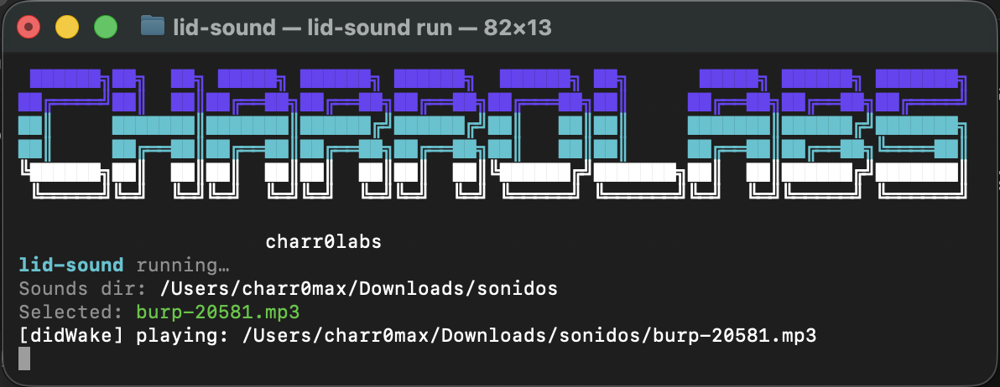

# lid-sound

A macOS CLI that plays a sound on lid-related events (currently: **wake / lid open**).
Includes an interactive terminal UI with sound preview.

---

## Install (Homebrew)

```bash
brew tap charromax/lid-sound
brew install lid-sound
```

Upgrade:

```bash
brew upgrade lid-sound
```

---

## Quick start

Check current configuration:

```bash
lid-sound status
```

Pick a sound (interactive UI):

- **↑ / ↓** move
- **Space** preview
- **Enter** select
- **Esc** back

```bash
lid-sound set-sound
```


Add your own `.mp3` files (they will be copied into the app sounds directory):

```bash
lid-sound add-sounds ~/path/to/my/sounds
```

Run the listener in the foreground:

```bash
lid-sound run
```

---

## Where sounds live

- **User sounds directory** (the app reads from here):
  ```
  ~/Library/Application Support/lid-sound/sounds
  ```

- **Default sounds directory** (installed by Homebrew):
  - Apple Silicon:
    ```
    /opt/homebrew/share/lid-sound/sounds
    ```
  - Intel:
    ```
    /usr/local/share/lid-sound/sounds
    ```

On first run, if the user sounds directory contains no `.mp3` files,
`lid-sound` automatically copies the defaults from the Homebrew share directory.

---

## Run at login (background)

To have `lid-sound` start automatically when you log in, use a **LaunchAgent**.

### 1) Find the installed binary path

```bash
which lid-sound
```

Typical paths:
- Apple Silicon: `/opt/homebrew/bin/lid-sound`
- Intel: `/usr/local/bin/lid-sound`

---

### 2) Create the LaunchAgent plist

Create the LaunchAgents directory if it does not exist:

```bash
mkdir -p ~/Library/LaunchAgents
```

Create the plist file:

```bash
nano ~/Library/LaunchAgents/com.charromax.lid-sound.plist
```

Paste the following (adjust the binary path if needed):

```xml
<?xml version="1.0" encoding="UTF-8"?>
<!DOCTYPE plist PUBLIC "-//Apple//DTD PLIST 1.0//EN" "http://www.apple.com/DTDs/PropertyList-1.0.dtd">
<plist version="1.0">
<dict>
  <key>Label</key>
  <string>com.charromax.lid-sound</string>

  <key>ProgramArguments</key>
  <array>
    <string>/opt/homebrew/bin/lid-sound</string>
    <string>run</string>
  </array>

  <key>RunAtLoad</key>
  <true/>

  <key>KeepAlive</key>
  <true/>

  <key>StandardOutPath</key>
  <string>/tmp/lid-sound.out</string>

  <key>StandardErrorPath</key>
  <string>/tmp/lid-sound.err</string>
</dict>
</plist>
```

---

### 3) Load / unload the agent

Load (start at login):

```bash
launchctl load ~/Library/LaunchAgents/com.charromax.lid-sound.plist
```

Unload (stop):

```bash
launchctl unload ~/Library/LaunchAgents/com.charromax.lid-sound.plist
```

Check if it is running:

```bash
launchctl list | grep lid-sound
```

View logs:

```bash
tail -n 200 /tmp/lid-sound.out
tail -n 200 /tmp/lid-sound.err
```

---

## Troubleshooting

### Multiple instances / double sounds

If multiple instances are running:

```bash
pkill -f lid-sound
```

Then reload the LaunchAgent or run `lid-sound run` again.

---

### No sounds in the picker

Add `.mp3` files and reopen the picker:

```bash
lid-sound add-sounds ~/path/to/sounds
lid-sound set-sound
```