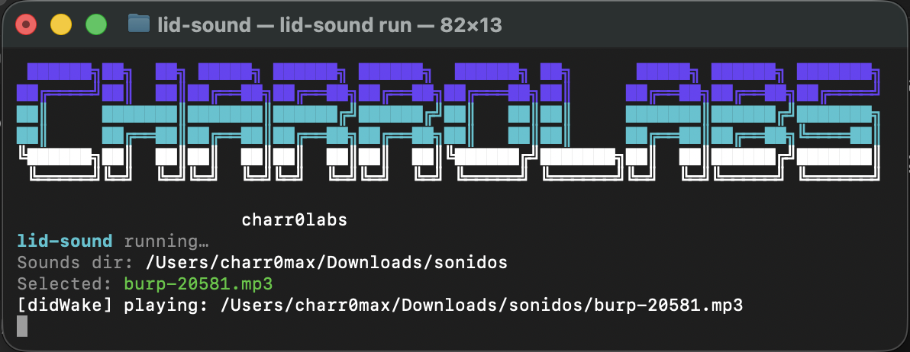
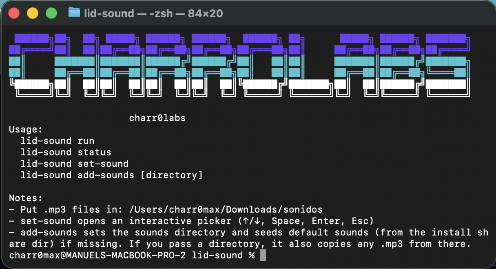

# lid-sound

A macOS CLI that turns lid motion into responsive audio on Macs with a readable
lid-angle sensor. On Macs without a usable sensor, it preserves one-shot sound
playback after wake.

---

## Install (Homebrew)

```bash
brew tap charromax/lid-sound
brew install lid-sound
```

Upgrade:

```bash
brew upgrade lid-sound
```

---

## Quick start

Check current configuration:

```bash
lid-sound status
```

Pick a sound (interactive UI):

- **↑ / ↓** move
- **Space** preview
- **Enter** select
- **Esc** back

```bash
lid-sound set-sound
```

Choose the source used for angle-driven audio:

```bash
lid-sound set-angle-mode
```

Select `bundled-loop` (the default) for the included sound or
`selected-sound` to loop the sound selected with `set-sound`. You can also set
the mode non-interactively:

```bash
lid-sound set-angle-mode bundled-loop
lid-sound set-angle-mode selected-sound
```

Changes made with `set-sound` or `set-angle-mode` reload the source in an
already-running `lid-sound run` listener. The selected file must be an MP3.



Add your own `.mp3` files (they will be copied into the app sounds directory):

```bash
lid-sound add-sounds ~/path/to/my/sounds
```

Run the listener in the foreground:

```bash
lid-sound run
```

At startup, `run` reports `Angle sensor: available: input reports ready` when
it can open the Apple lid-angle HID input-report endpoint. If it reports an
unavailable sensor and a reason, lid-sound keeps running with the existing
wake-event fallback. `lid-sound status` performs the same readiness probe and
shows the active angle-audio mode and any selected-sound availability problem.

When the sensor is readable, the active source is prepared at startup and starts
when the lid moves. Lid angle controls pitch from 0 through 130 degrees, while
movement speed controls volume: motion at or below 1.5 degrees per second is
silent and volume reaches maximum at 15 degrees per second. When the lid stops,
the source fades promptly to silence while remaining prepared; short pauses
therefore resume without restarting the loop. This behavior applies to both
bundled-loop and selected-sound modes. A readable sensor does not also trigger
a second wake sound. A selected MP3 can have audible loop boundaries because
arbitrary user audio is not converted into a seamless loop.

---

## Where sounds live

- **User sounds directory** (the app reads from here):
  ```
  ~/Library/Application Support/lid-sound/sounds
  ```

- **Default sounds directory** (installed by Homebrew):
  - Apple Silicon:
    ```
    /opt/homebrew/share/lid-sound/sounds
    ```
  - Intel:
    ```
    /usr/local/share/lid-sound/sounds
    ```

On first run, if the user sounds directory contains no `.mp3` files,
`lid-sound` automatically copies the defaults from the Homebrew share directory.

The bundled angle-motion fallback MP3 is packaged with the SwiftPM executable
during development.
For Homebrew installations, it is resolved from:

- Apple Silicon: `/opt/homebrew/share/lid-sound/lid-motion-loop.mp3`
- Intel: `/usr/local/share/lid-sound/lid-motion-loop.mp3`

The bundled sound may repeat while the lid is moving. A selected MP3 can also
have audible loop boundaries.

---

## Run at login (background)

To have `lid-sound` start automatically when you log in, use a **LaunchAgent**.

### 1) Find the installed binary path

```bash
which lid-sound
```

Typical paths:
- Apple Silicon: `/opt/homebrew/bin/lid-sound`
- Intel: `/usr/local/bin/lid-sound`

---

### 2) Create the LaunchAgent plist

Create the LaunchAgents directory if it does not exist:

```bash
mkdir -p ~/Library/LaunchAgents
```

Create the plist file:

```bash
nano ~/Library/LaunchAgents/com.charromax.lid-sound.plist
```

Paste the following (adjust the binary path if needed):

```xml
<?xml version="1.0" encoding="UTF-8"?>
<!DOCTYPE plist PUBLIC "-//Apple//DTD PLIST 1.0//EN" "http://www.apple.com/DTDs/PropertyList-1.0.dtd">
<plist version="1.0">
<dict>
  <key>Label</key>
  <string>com.charromax.lid-sound</string>

  <key>ProgramArguments</key>
  <array>
    <string>/opt/homebrew/bin/lid-sound</string>
    <string>run</string>
  </array>

  <key>RunAtLoad</key>
  <true/>

  <key>KeepAlive</key>
  <true/>

  <key>StandardOutPath</key>
  <string>/tmp/lid-sound.out</string>

  <key>StandardErrorPath</key>
  <string>/tmp/lid-sound.err</string>
</dict>
</plist>
```

---

### 3) Load / unload the agent

Load (start at login):

```bash
launchctl load ~/Library/LaunchAgents/com.charromax.lid-sound.plist
```

Unload (stop):

```bash
launchctl unload ~/Library/LaunchAgents/com.charromax.lid-sound.plist
```

Check if it is running:

```bash
launchctl list | grep lid-sound
```

View logs:

```bash
tail -n 200 /tmp/lid-sound.out
tail -n 200 /tmp/lid-sound.err
```

---

## Troubleshooting

### Multiple instances / double sounds

If multiple instances are running:

```bash
pkill -f lid-sound
```

Then reload the LaunchAgent or run `lid-sound run` again.

---

### No sounds in the picker

Add `.mp3` files and reopen the picker:

```bash
lid-sound add-sounds ~/path/to/sounds
lid-sound set-sound
```